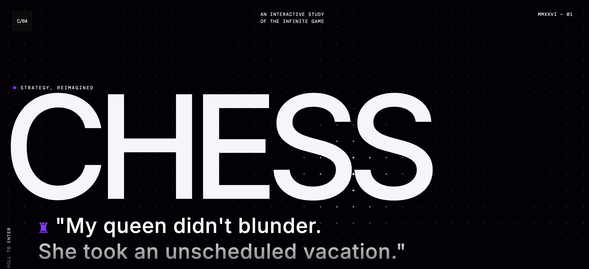
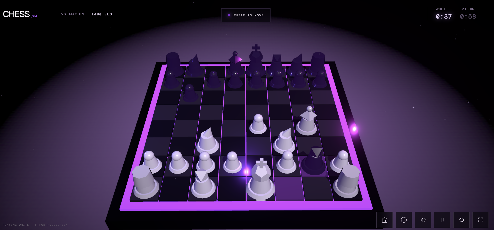
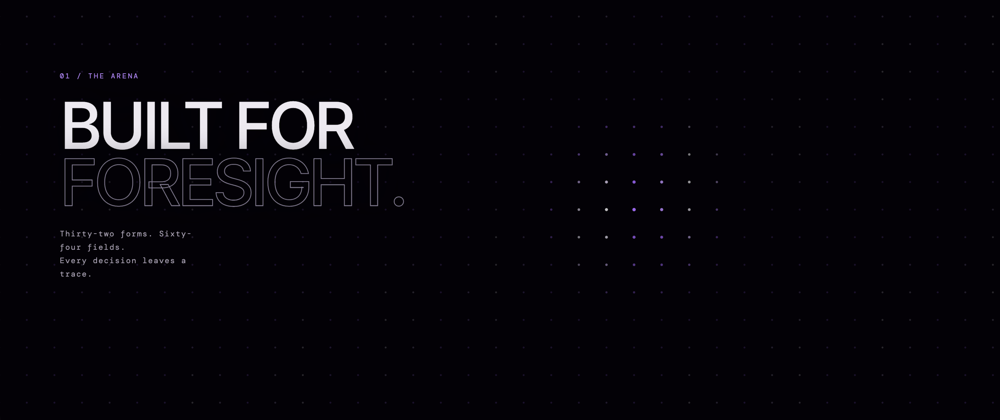
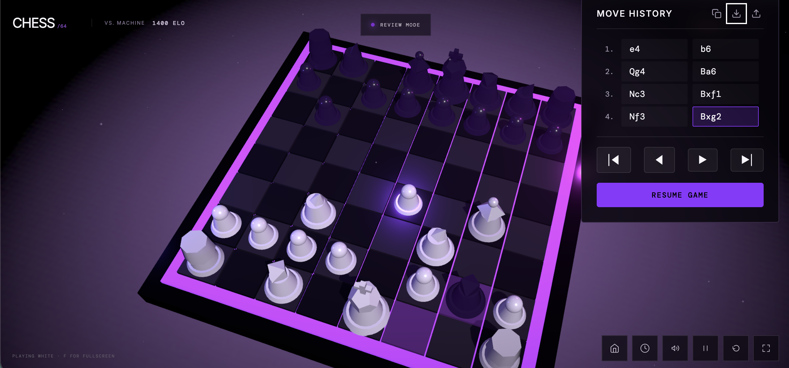
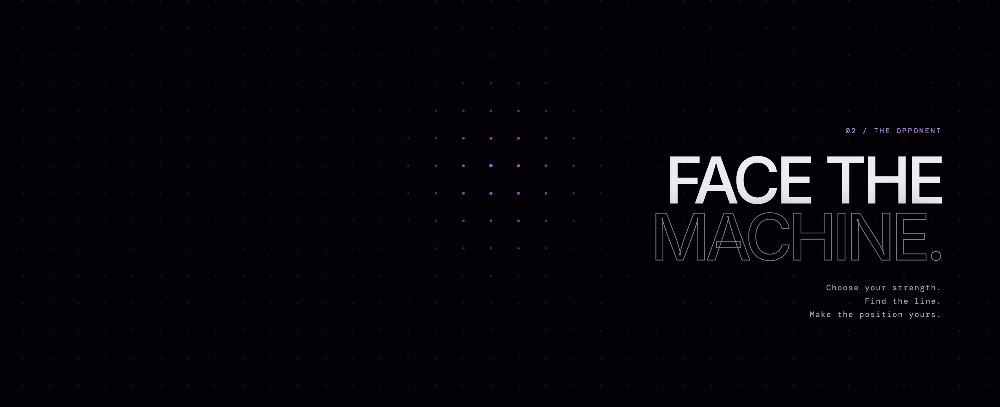
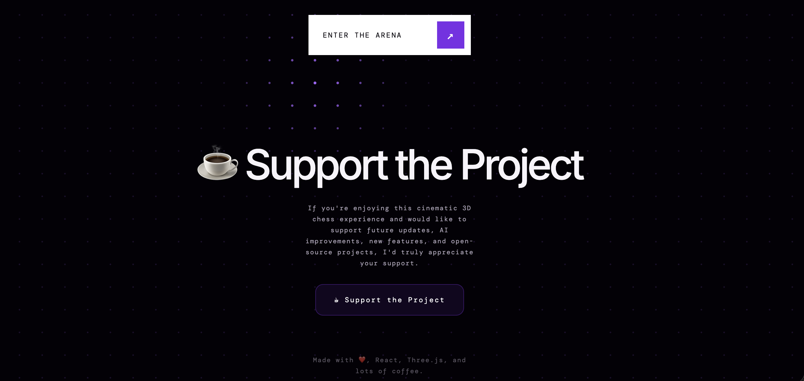

<div align="center">

# ♟️ Cinematic Chess Game 3D

**An interactive study of the infinite game, reimagined with immersive 3D graphics, artificial intelligence, and cinematic storytelling.**

<p align="center">
  
  
  
  
  
</p>

<br />

<a href="https://your-demo-url-here.com" target="_blank">
  
</a>

<br /><br />

</div>

---

## 📸 Experience the Arena

<div align="center">
  <table>
    <tr>
      <td align="center" width="50%">
        
        <br />
        <em>Cinematic Landing Experience</em>
      </td>
      <td align="center" width="50%">
        
        <br />
        <em>Interactive 3D Chess Board</em>
      </td>
    </tr>
    <tr>
      <td align="center" width="50%">
        
        <br />
        <em>Animated Dot Grid & Features</em>
      </td>
      <td align="center" width="50%">
        
        <br />
        <em>Position Review & Move History</em>
      </td>
    </tr>
    <tr>
      <td align="center" width="50%">
        
        <br />
        <em>Face the Machine</em>
      </td>
      <td align="center" width="50%">
        
        <br />
        <em>Support & Community</em>
      </td>
    </tr>
  </table>
</div>

---

## ✨ Features

<table>
  <tr>
    <td width="50%">
      <h3>🎮 Immersive Gameplay</h3>
      <ul>
        <li><strong>Interactive 3D Chess</strong> powered by Three.js</li>
        <li><strong>Cinematic Environment</strong> with dynamic lighting & particles</li>
        <li><strong>Premium Audio</strong> & seamless move animations</li>
        <li><strong>Chess Clock</strong> & fully functional timers</li>
      </ul>
    </td>
    <td width="50%">
      <h3>🤖 Advanced AI & Analytics</h3>
      <ul>
        <li><strong>Stockfish AI</strong> integration directly in the browser</li>
        <li><strong>Post-game Analysis</strong> to find your blunders and brilliant moves</li>
        <li><strong>Opening Recognition</strong> covering modern lines</li>
        <li><strong>Position Review</strong> mode to rewind past decisions</li>
      </ul>
    </td>
  </tr>
  <tr>
    <td width="50%">
      <h3>🌟 Premium User Interface</h3>
      <ul>
        <li><strong>Cinematic Landing Experience</strong> introducing the arena</li>
        <li><strong>Animated Dot Grid</strong> background with glassmorphism elements</li>
        <li><strong>Scroll Animations</strong> driven by GSAP</li>
        <li><strong>Responsive Design</strong> matching desktop, tablet, and mobile</li>
      </ul>
    </td>
    <td width="50%">
      <h3>⚙️ Tools & Utilities</h3>
      <ul>
        <li><strong>PGN Import / Export</strong> to share or save your games</li>
        <li><strong>Move History</strong> log displaying all legal notation</li>
        <li><strong>Keyboard Shortcuts</strong> for rapid control and flow</li>
        <li><strong>Zero-Latency Processing</strong> via WebAssembly</li>
      </ul>
    </td>
  </tr>
</table>

---

## 🛠️ Tech Stack

This project was built with modern, high-performance web technologies:

- **React** for declarative UI construction
- **TypeScript** for type-safe logic and game state
- **Three.js & React Three Fiber** for hardware-accelerated 3D graphics
- **GSAP** for fluid, complex layout animations
- **Vite** for lightning-fast build tooling
- **Stockfish** (WASM) for the underlying chess engine
- **CSS** strictly utilizing raw, vanilla styling with modern clamping techniques

---

## 🚀 Installation

Run the project locally to play against the machine or modify the environment.

```bash
# 1. Clone the repository
git clone https://github.com/srjay999-giT/cinematic-chess-game3D.git

# 2. Navigate to the project directory
cd cinematic-chess-game3D

# 3. Install dependencies
npm install

# 4. Start the development server
npm run dev

# 5. Build for production
npm run build
```

---

## 📂 Folder Structure

```text
cinematic-chess-game3D/
├── assets/
│   └── screenshots/          # High-resolution README images
├── public/
│   └── engine/               # Stockfish WASM engine files
├── src/
│   ├── ai.ts                 # AI integration and engine communication
│   ├── analyzer.ts           # Game analysis logic
│   ├── audio.ts              # Sound effect definitions and manager
│   ├── openings.ts           # Opening book classification
│   ├── types.ts              # TypeScript interfaces and game types
│   ├── styles.css            # Global application styling
│   ├── vite-env.d.ts         # Environment type declarations
│   ├── App.tsx               # Main application routing and UI overlays
│   ├── DotGrid.tsx           # Animated landing page background
│   ├── GameScene.tsx         # The core Three.js 3D chess environment
│   └── main.tsx              # React entry point
├── package.json              # Project dependencies and scripts
├── tsconfig.json             # TypeScript configuration
├── vite.config.ts            # Vite bundler settings
└── README.md                 # Project documentation
```

---

## 🗺️ Roadmap

- [ ] Online Multiplayer Matchmaking
- [ ] User Accounts & Authentication
- [ ] Global Leaderboards & Ratings
- [ ] Daily Chess Challenges
- [ ] Curated Puzzle Mode
- [ ] Customizable 3D Themes & Board Materials
- [ ] Blockchain Achievement System

---

## ☕ Support the Project

If you're enjoying this cinematic 3D chess experience and would like to support future updates, AI improvements, new features, and open-source projects, I'd truly appreciate your support.

<a href="https://buymeacoffee.com/jaygadage" target="_blank">
  
</a>

---

## 👋 About the Developer

**Hi, I'm Jayla**  
*Computer Science Student | Python Developer | Blockchain Enthusiast | AI & Full-Stack Developer | Vibe Coder*

I enjoy building immersive web experiences that combine AI, 3D graphics, blockchain technology, and beautiful user interfaces. 

---

## ©️ Copyright

© 2026 Jay Gadage. All Rights Reserved.

This repository is shared for portfolio and educational purposes.  
Please do not copy, redistribute, modify, or commercially reuse the code without my written permission.

---

<div align="center">
  <h3>Enjoy the project?</h3>
  <p>Don't forget to leave a ⭐ to show your support!</p>
</div>
